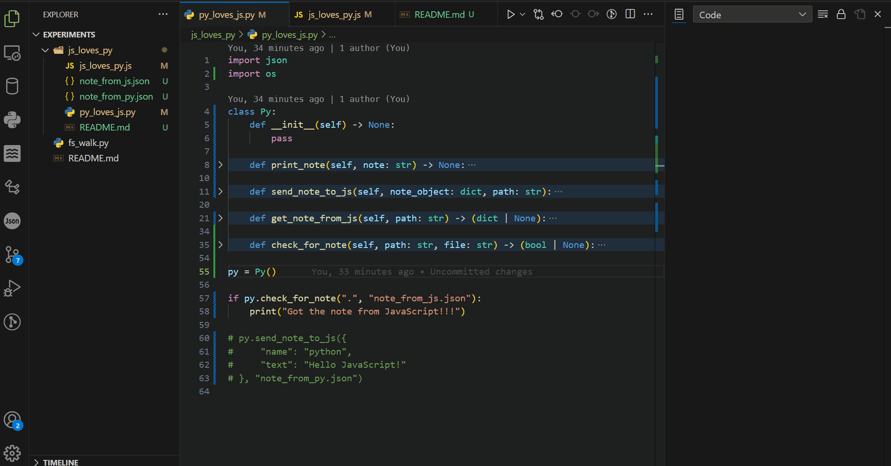

# JS ❤️ PY

## JavaScript and Python Coupling

> JS Loves Py is a set of scripts that will allow you to easily pass data back and forth between JavaScript and Python using Json. I created this project to highlight this ability. It demonstrates one of many ways you can couple langauges together to work with one another. The ability to pass data back and forth between two languages like Python and JavaScript opens doors to a universe of new possibilities.

## [Table Of Contents](#table-of-contents)

- [Table of Contents](#table-of-contents)
- [About](#about)
- [Usage](#usage)
  - [JS Class Methods](#js-class-methods)
  - [Py Class Methods](#py-class-methods)
  - [Examples](#examples)
    - [JS ➟ Py](#js2py)
    - [Py ➟ JS](#py2js)
- [Use Cases](#use-cases)
  - [Web Development](#web-development)
  - [Data Visualization](#data-visualization)
  - [Full-Stack Applications](#full-stack-applications)
  - [Machine Learning and AI](#machine-learning-and-ai)
  - [Cross-Platform Desktop Applications](#desktop-applications)
  - [Embedded Widgets & Widgets in Content Management Systems](#content-management-systems)
- [Benefits of Using JavaScript with Python](#benefits)
  - [Leveraging Strengths](#leveraging-strengths)
  - [Ecosystem Diversity](#ecosystem-diversity)
  - [Flexibility](#flexibility)
  - [Separation of Concerns](#seperation-of-concerns)
  - [Scalability](#scalability)
- [Contributing](#contributing)
- [Security](#security)
- [Contacts](#contacts)
---

# [About](#about)
JS loves Py contains two classes. One in JavaScript called `JS()` and the other in Python call `Py()`. These two classes are identical other than the fact that one is written in Python and the other in JavaScript. Both classes allow you to pass an object back and forth between Python and JavaScript easily using Json. Each class creates a Json file which it will store the data being passed in. The Json files created by both classes are called `from_js.json` and `from_py.json` respectively.

Since Json, a JavaScript object and a Python dictionary all have the same syntax this can be leveraged to easily pass objects back and forth between Python and JavaScript (*or really any language that can work with Json and/or has a similar object like structure {}*). On top of that you can create listeners to automate getting the data being passed as I have here with the `JS.checkForNote()` and `Py.check_for_note()` methods.
All you have to do is specify the path to the place where the ***from_js.json*** and ***from_py.json*** files will be created by passing it to whichever listener is being used or both.

> Heres an example of the listeners in both scripts in action. In this example I drag and drop the data files into the directory being listened to for the sake of time. You can see though that as I drop each file into the folder the output displays the contents.



In case you aren't familiar these are examples of Json, a JS Object and a Python dictionary to show that they all have the exact same syntax.

[**Json (JavaScript Object Notation)**](#json)
```json
{
    "name": "json",
    "msg": "Hello, world I'm Json"
}
```
[**Python Dictionary {}**](#python-dict)
```python
note = {
    "name": "python",
    "msg": "Hello, world I'm Python"
}
```

[**JavaScript Object {}**](#javascript-object)
```javascript
let note = {
    "name": "javascript",
    "msg": "Hello, world I'm JavaScript"
}
```
---

## [Usage](#usage)

Both the `JS` and the `Py` classes have the exact same functionality and contain the same methods and properties as follows:

### [JS Class Methods](#js-class-methods)
- `JS.NOTE` - This is where the retieved data from Py is stored
- `JS.JSON_PATH` - This will store the path passed to checkForNote()
- `JS.sendNoteToPy(note_object, path)`
- `JS.getNoteFromPy(path)`
- `JS.checkForNote(path)`


### [Py Class Methods](#py-class-methods)
- `Py.NOTE` - This is where the retieved data from JS is stored
- `Py.JSON_PATH` - This will store the path passed to check_for_note()
- `Py.send_note_to_js(self, note_object: dict, path: str)`
- `Py.get_note_from_js(self, path: str)`
- `Py.check_for_note(self, path: str, file: str)`

---

## [Examples](#examples)

### [JS ➟ Py](#js2py)

To get an object from **JavaScript** to **Python** do the following:

1) In your Python program create a new instance of the **Py** class and then call the `check_for_note()` method passing in the path to watch and let it run.
```python
py = Py()
py.check_for_note("C:\\MyPyApp\\")
``` 
   
> \* NOTE * The `Py.check_for_note` and `JS.checkForNote` methods both have the ability to detect the object/dict being sent from one another, so you can have the `Py.checkForNote` or the `JS.checkForNote` method running already and when the object is sent and it will detect the json file, get the data object, and store it for you.


2) Now in your JavaScript program create a new instance of the **JS** class and then call the `sendNoteToPy()` method passing in the object containing whatever data you want as the first argument.
```javascript
const js = new JS()
sendNoteToPy({
     "title": "Note to Py from JS",
     "text": "Hello Python!"
}, "note_from_js.json")
```

Once the `sendNoteToPy()` method is called the object you passed in will be stored in the ***from_js.json*** file at the specified path and this will automatically be picked up on the Python side by the running `Py.check_for_note()` method from step 1. The data will be stored in the `Py.NOTE` property and accessible from there.

### [Py ➟ JS](#js2py)

To get an object from **Python** to **JavaScript** do the same thing as in [JS ➟ Py](#js2py) but in reverse as follows:

1) In your JavaScript program create a new instance of the **JS** class and then call the `checkForNote()` method passing in the path to watch and let it run.
```python
js = JS()
js.checkForNote("C:\\MyPyApp\\")
``` 

2) Now in your Python program create a new instance of the **Py** class and then call the `send_note_to_js()` method passing in the object containing whatever data you want as the first argument.
```javascript
py = Py()
py.send_note_to_js({
     "title": "Note to JS from Py",
     "text": "Hello JavaScript!"
})
```

Once the `send_note_to_js()` method is called the object you passed in will be stored in the ***from_py.json*** file at the specified path and this will automatically be picked up on the JavaScript side by the running `JS.checkForNote()` method from step 1. The data will be stored in the `js.NOTE` property and accessible from there.

## [Use Cases](#use-cases)
Using Python and JavaScript together can be pretty powerful and flexible, as each language has its own strengths and use cases. Below are some common scenarios where combining Python and JavaScript can provide benefits:

### [Web Development:](#web-development)

* **Backend (Python) and Frontend (JavaScript):** Python can be used for server-side logic, data processing, and business logic, while JavaScript can handle dynamic content, user interaction, and frontend development.
* **AJAX Requests:** JavaScript can make asynchronous requests to Python backend APIs using technologies like [AJAX](https://developer.mozilla.org/en-US/docs/Web/Guide/AJAX) (*Asynchronous JavaScript and XML*) to update specific parts of a webpage without requiring a full page reload.

### [Data Visualization:](#data-visualization)

* **Python Data Processing + JavaScript Visualization Libraries:** Python is often used for data processing and analysis using libraries like **NumPy**, **pandas**, and **Matplotlib**. Once data is prepared, it can be visualized using JavaScript libraries like **D3.js**, **Plotly**, or **Chart.js** for interactive and dynamic visualizations in web applications.

### [Full-Stack Applications:](#full-stack-applications)

* **Single Page Applications (SPAs):** Using frameworks like **Django (Python)** for backend and **React** or **Vue.js** (JavaScript) for frontend allows developers to create seamless, efficient, and interactive [SPAs](https://en.wikipedia.org/wiki/Single-page_application) where the two languages work together to deliver a cohesive user experience.

### [Machine Learning and AI:](#machine-learning-and-ai)

* **Python Backend for Model Inference:** Python's extensive machine learning and AI libraries like **TensorFlow**, **PyTorch**, and **scikit-learn** can be used to build and train models. JavaScript can then be used to deploy these models in web applications for real-time predictions and interactive user experiences.

### [Cross-Platform Desktop Applications:](#desktop-applications)

* **Python Backend + Electron (JavaScript) Frontend:** Combining Python with [Electron](https://www.electronjs.org/) (*a framework for building cross-platform desktop applications using web technologies*) allows you to create desktop applications that have a Python backend and a JavaScript-based frontend.

### [Embedded Widgets and Widgets in Content Management Systems:](#content-management-systems)

* **Embedding Interactive Elements:** Python can be used to generate dynamic content or widgets, which can then be embedded in websites or content management systems using JavaScript. This is particularly useful for incorporating custom functionality or interactivity.

## [Benefits of Using JavaScript with Python](#benefits)


Programming is like art in a way. You're not locked into building specific things in specific ways, but rather you have the abilty to build what you want and how you want. Programming languages are flexible enough that you can do the same thing many different ways, whatever that thing your doing is. You can build a desktop app - frontend and backend - entirely with JavaScript, but I wanted to focus on using Python and JavaScript together so the following are some benefits I can think of.

### [Leveraging Strengths:](#leveraging-strengths)
 Python is known for its data processing, scientific computing, and machine learning capabilities, while JavaScript is known for its ability to create interactive and dynamic user interfaces. By combining these strengths, you can create more feature-rich and interactive applications. As I mentioned previously, it opens up a lot of possibilities.

### [Ecosystem Diversity:](#ecosystem-diversity)
 Both Python and JavaScript have vast ecosystems of libraries, frameworks, and tools. Combining them allows you to choose the best tools for each part of your application, optimizing for performance, functionality, and developer familiarity.

### [Flexibility:](#flexibility)
Using both languages enables you to address a wider range of challenges and create more versatile applications.

### [Separation of Concerns:](#seperation-of-concerns)
 Separating backend logic (Python) from frontend presentation (JavaScript) follows the principle of [separation of concerns](https://en.wikipedia.org/wiki/Separation_of_concerns), making your codebase more maintainable and easier to debug.

### [Scalability:](#scalability)
By splitting your application into backend and frontend components, you can scale each part independently based on demand, optimizing performance and resource usage.

## [Contributing](#contributing)

If you have any feature requests, suggestions or general questions you can 
reach me via any of the methods listed below in the [Contacts](#contacts) section.

---

## [Security](#security)

### Reporting a vulnerability or bug?

**Do not submit an issue or pull request**: A general rule of thumb is to 
never publicly report bugs or vulnerabilities because you might inadvertently 
reveal it to unethical people who may use it for bad. Instead, you can email 
me directly at: [paulmccarthy676@gmail.com](mailto:paulmccarthy676@gmail.com). 
I will deal with the issue privately and submit a patch as soon as possible.

---

## [Contacts](#contacts)

**Author:** Paul M.

* Email: [paulmccarthy676@gmail.com](mailto:paulmccarthy676@gmail.com)
* Github: [https://github.com/happycod3r](https://github.com/happycod3r)
* Linkedin: [https://www.linkedin.com/in/paul-mccarthy-89165a269/]( https://www.linkedin.com/in/paul-mccarthy-89165a269/)
* Facebook: [https://www.facebook.com/paulebeatz]( https://www.facebook.com/paulebeatz)

---

